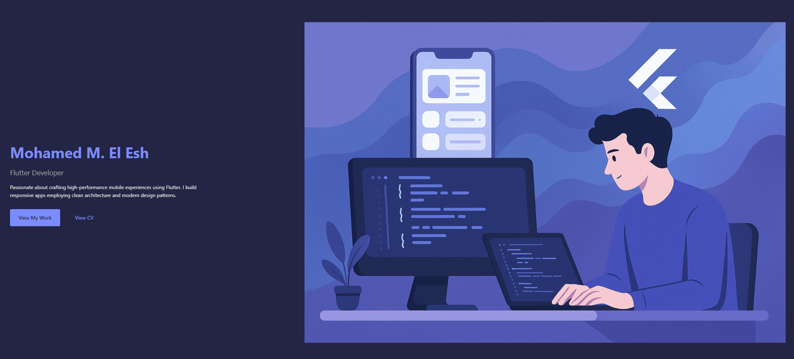

# 🌐 Mohamed M. El Esh – Flutter Developer Portfolio

Welcome to my personal portfolio website — a modern, responsive, and accessible web app built with **HTML**, **CSS**, and **JavaScript**.  
It showcases my projects, skills, and experience as a **Junior Flutter Developer** specializing in clean architecture, APIs, and modern mobile UI design.

---

## 🚀 Features

✅ Fully responsive design (desktop, tablet, and mobile)  
✅ Smooth entry animations (fade, slide, and scale)  
✅ Light/Dark theme toggle (auto detects system mode)  
✅ Keyboard accessible navigation  
✅ Dynamic current year in footer  
✅ Project cards include:
- Preview images  
- LinkedIn post links  
- Live demo links  
- GitHub repository buttons  

---

## 🧰 Technologies Used

| Category | Tools |
|-----------|-------|
| **Frontend** | HTML5, CSS3, JavaScript (ES6) |
| **Styling** | Flexbox, CSS Grid, Media Queries |
| **Animations** | CSS Transitions, Scroll Reveal |
| **Version Control** | Git & GitHub |
| **Design Tools** | Figma, Canva |
| **Deployment** | GitHub Pages / Netlify |

---

## 📂 Folder Structure

```

portfolio/
│
├── index.html              # Main portfolio page
│
├── css/
│   └── style.css           # Styles and animations
│
├── js/
│   └── script.js           # Theme switch, animation triggers, etc.
│
├── images/
│   └── projects/           # Project screenshots
│       ├── albaker.png
│       ├── qroll.png
│       ├── chatapp.png
│       └── hungry.png
│
└── README.md               # Project documentation

````

---

## 🧩 How to Run Locally

1. **Clone the repository**
   ```bash
   git clone https://github.com/MohammedElEsh/website.git
````

2. **Navigate into the folder**

   ```bash
   cd portfolio
   ```

3. **Run the project**

   * Option 1: Double-click `index.html`
   * Option 2: Use VS Code + *Live Server* extension

Your portfolio should now open in your default browser 🎉

---

## 💼 Projects Included

| Project                           | Description                                                                                          | Links                                                                                                                                             |
| --------------------------------- | ---------------------------------------------------------------------------------------------------- | ------------------------------------------------------------------------------------------------------------------------------------------------- |
| **Al Baker Air Conditioning App** | E-commerce & service Flutter app with Arabic UI, JWT auth, and RESTful API integration using Dio.    | [🔗 LinkedIn Post](https://www.linkedin.com/posts/mohamed-m-el-esh-a97999283_flutter-firstflutterapp-mobileapp-activity-7350547425742192640-Jkzy) |
| **QRoll Attendance App**          | Role-based attendance app with QR code scanning, JWT auth, Riverpod state management, and REST APIs. | [🔗 LinkedIn Post](https://www.linkedin.com/posts/mohamed-m-el-esh-a97999283_flutter-mobiledevelopment-edtech-activity-7349891273740226560-olXd)  |
| **Chat Application**              | Real-time cross-platform chat app using Firebase, Supabase & Zego SDK for calls and media sharing.   | [🔗 LinkedIn Post](https://www.linkedin.com/posts/mohamed-m-el-esh-a97999283_flutter-firebase-cleanarchitecture-activity-7384565007084195840-lB7e)  |
| **Hungry App**                    | Flutter food ordering app with filters, dynamic cart, payment integration, and user profile.         | [💻 GitHub Repo](https://github.com/MohammedElEsh/hungry.git)                                                                                      |

---

## 🖼️ Preview

> *(Add a screenshot if you like — e.g. `images/preview.png`)*
> 

---

## 🧠 Future Improvements

* Add backend for contact form submissions
* Project filtering/search feature
* Blog or article section
* Deploy with a custom domain
* Convert into a PWA (Progressive Web App)

---

## 👨‍💻 Author

**Mohamed M. El Esh**
📱 *Junior Flutter Developer*
💼 [LinkedIn](https://www.linkedin.com/in/mohamed-m-el-esh-a97999283/)
💻 [GitHub](https://github.com/MohammedElEsh)
✉️ *[mohamedelesh34@gmail.com](mailto:mohamedelesh34@gmail.com)*

---

## 📜 License

This project is licensed under the **MIT License** — feel free to use or modify it with proper credit.

---

### ⭐ Support

If you like this portfolio, please **star** the repository — it really helps and motivates me to keep improving it!

```

---

Would you like me to add a **“Deployment”** section for GitHub Pages (so people can view it live from your repo)?
```
